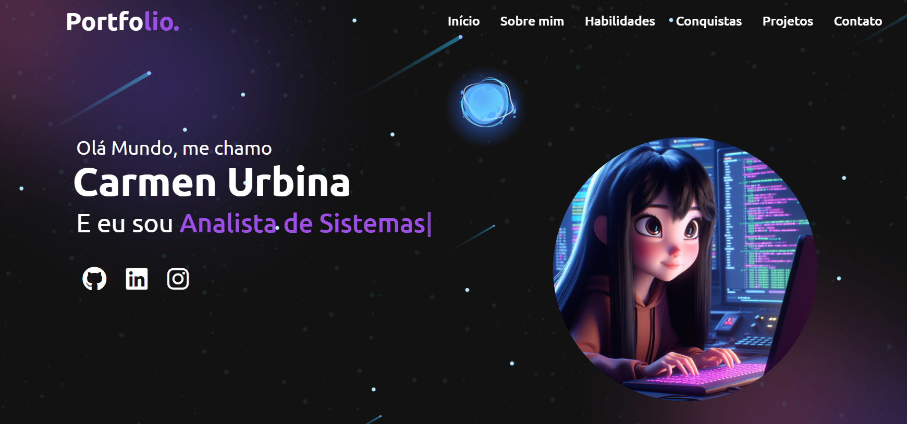

<h1 align="center">Meu Portfólio 💜</h1>

  <a href="#-tecnologias">Tecnologias</a>&nbsp;&nbsp;&nbsp;|&nbsp;&nbsp;&nbsp;
  <a href="#-projeto">Projeto</a>&nbsp;&nbsp;&nbsp;|&nbsp;&nbsp;&nbsp;

 

## 🚀 Tecnologias

Esse repositório contém essas tais tecnologias :

- HTML
- CSS
- JavaScript

## 💻 Projeto

Desenvolvi o meu próprio site para poder compartilhar a minha tranjetória na programação e mostrar minhas skills no momento!

## 🔗 Para testar accesar ao link
https://ofelia-1985.github.io/personal-portfolio-carmen/

## 🖼️ Tela Inicial :

  

